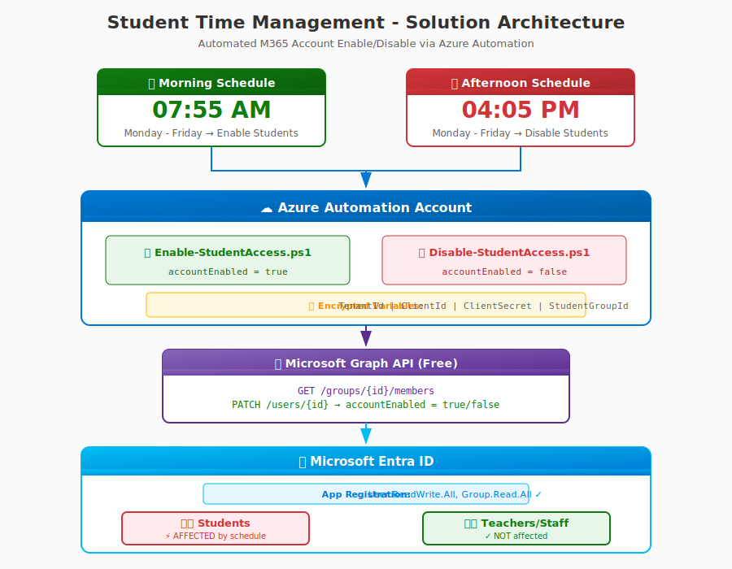

# Student Time Management for Microsoft 365

> **Automate student account sign-in restrictions** for Microsoft 365 / Entra ID (Azure AD) using Azure Automation and Microsoft Graph API.

[](https://portal.azure.com)
[](https://opensource.org/licenses/MIT)

## 🎯 Purpose

This solution allows schools to **restrict student login times** to school hours in a **cloud-only Entra ID environment** where native logon hour restrictions are not available.

### Schedule

| Day | Hours | Status |
| ----- | ------- | -------- |
| **Monday - Friday** | 07:55 AM - 04:05 PM | 🟢 Students ENABLED |
| **Monday - Friday** | 04:05 PM - 07:55 AM | 🔴 Students DISABLED |
| **Saturday - Sunday** | All day | 🔴 Students DISABLED |

### Who Is Affected?

| User Type | Affected? |
| ----------- | ----------- |
| **Students** | ✅ YES - Only members of the specified security group |
| **Teachers** | ❌ NO - Not in the student group |
| **Admins** | ❌ NO - Not in the student group |
| **Staff** | ❌ NO - Not in the student group |

### Why This Solution?

Microsoft confirms that **native time-based login restrictions are NOT supported** in cloud-only Entra ID:

> *"Unfortunately it is not possible to restrict user login to a specific time frame on Azure AD. Azure AD / O365 does not 'understand' Logon Hours."*
> — Microsoft Support Documentation

This repository provides a complete, production-ready workaround.

---

## ⚠️ Important: User Experience Notice

**Microsoft warns that this workaround provides a poor user experience.** Students will:

- Be **immediately logged out** when accounts are disabled
- Potentially **lose unsaved work**
- Need to **re-authenticate** each morning

Please communicate this clearly to students and staff before implementation.

---

## � Cost & Requirements

### No Extra Licenses Needed

This solution works with your **existing M365 Education licenses**. No additional per-user licenses required.

| Component | Cost (Non-Profit) | Cost (Regular) | Required? |
| ----------- | ------------------- | ---------------- | ----------- |
| Azure Subscription | **FREE** ($3,500/yr credits) | Pay-as-you-go | ✅ Yes |
| Azure Automation | **€0-3/month** | €5-8/month | ✅ Yes |
| M365 Education | Already have | Already have | ✅ Yes |
| Entra ID Premium | - | - | ❌ Not needed |
| Intune | - | - | ❌ Not needed |
| GitHub (for IaC) | **€0** (Free tier) | €0-19/user | ⚪ Optional |

**Monthly Total (Non-Profit): €0-4/month** | **Setup Time: 2-4 hours**

> 📖 See [SOLUTION-ARCHITECTURE.md](docs/SOLUTION-ARCHITECTURE.md#cost--licensing) for detailed cost breakdown and Azure Nonprofit setup.

---

## 📋 Prerequisites

| Requirement | Details |
| ------------- | --------- |
| Microsoft 365 | Education subscription (A1, A3, or A5) ✅ |
| Azure Subscription | [Free for nonprofits](https://nonprofit.microsoft.com) or Pay-as-you-go |
| Permissions | Global Administrator or Application Administrator |
| Student Group | Security group containing student accounts |

---

## 📚 Documentation

| Document | Description | Format |
| ---------- | ------------- | -------- |
| [Required Roles & Permissions](docs/REQUIRED-ROLES.md) | All roles needed for deployment | Markdown |
| [Required Roles (HTML)](docs/required-roles.html) | Detailed guide with GUI instructions | HTML |
| [Operations Guide](docs/OPERATIONS-GUIDE.md) | Day-to-day operations and maintenance | Markdown |
| [Operations Guide (HTML)](docs/operations-guide.html) | Visual guide with screenshots placeholders | HTML |
| [Solution Architecture](docs/SOLUTION-ARCHITECTURE.md) | Technical architecture details | Markdown |
| [Email: Access Request](docs/email-access-request.html) | Request deployment access from customer | HTML |
| [Email Templates](docs/archive/) | Archived customer proposal email templates | HTML |

---

## 🏗️ Architecture



<!-- markdownlint-disable MD033 -->
<details>
<summary>📋 Text-based architecture (for accessibility)</summary>
<!-- markdownlint-enable MD033 -->

```text
┌─────────────────────────────────────────────────────────────────┐
│                     Azure Automation                            │
├─────────────────────────────────────────────────────────────────┤
│  ┌──────────────────┐          ┌──────────────────┐            │
│  │ Enable-Student   │          │ Disable-Student  │            │
│  │ Access.ps1       │          │ Access.ps1       │            │
│  └────────┬─────────┘          └────────┬─────────┘            │
│           │                             │                       │
│  Schedule: 07:55 AM             Schedule: 16:05 PM              │
│  Mon-Fri                        Mon-Fri                         │
└───────────┼─────────────────────────────┼───────────────────────┘
            │                             │
            ▼                             ▼
┌─────────────────────────────────────────────────────────────────┐
│                    Microsoft Graph API                          │
│              PATCH /users/{id} accountEnabled                   │
└─────────────────────────────────────────────────────────────────┘
            │                             │
            ▼                             ▼
┌─────────────────────────────────────────────────────────────────┐
│                    Entra ID (Azure AD)                          │
│                    Student Accounts                             │
└─────────────────────────────────────────────────────────────────┘
```

</details>

---

## 📁 Project Structure

```text
StudentTime-Management-M365/
├── .github/
│   ├── workflows/
│   │   └── deploy-infrastructure.yml    # GitHub Actions CI/CD
│   └── copilot-instructions.md
├── config/
│   └── config.template.json             # Configuration template
├── docs/
│   └── email-template.html              # Customer communication template
├── infrastructure/
│   └── main.bicep                       # Infrastructure as Code (Bicep)
├── runbooks/
│   ├── Enable-StudentAccess.ps1         # Enable accounts (morning)
│   ├── Disable-StudentAccess.ps1        # Disable accounts (afternoon)
│   └── Get-StudentAccessStatus.ps1      # Status report
├── scripts/
│   ├── Start-StudentAccessMenu.ps1      # 🎯 Interactive menu (START HERE)
│   ├── SecureCredentialManager.psm1     # Secure credential storage
│   ├── Deploy-ToAzureDirect.ps1         # Direct Azure deployment
│   ├── Deploy-StudentAccessAutomation.ps1
│   ├── New-AppRegistration.ps1          # Create Entra ID app
│   ├── New-GitHubFederation.ps1         # GitHub OIDC setup
│   └── Test-StudentAccess.ps1           # Local testing
├── .gitignore
├── LICENSE
└── README.md
```

---

## 🧪 Testing First (Recommended)

> **⚠️ Always test with a small group before production deployment!**

The solution **only affects members of the security group** you specify. Teachers, admins, and staff are **never touched**.

### Quick Test Setup

```powershell
# 1. Run the test environment setup script
.\scripts\Setup-TestEnvironment.ps1

# 2. Optionally create test user accounts
.\scripts\Setup-TestEnvironment.ps1 -CreateTestUsers -TestUserCount 3
```

This will:

1. Create a test security group: `StudentAccess-TestGroup`
2. Optionally create test student accounts
3. Output the **Group ID** to use during deployment

### Test → Production Workflow

| Phase | Group | Duration |
| ------- | ------- | ---------- |
| **Testing** | `StudentAccess-TestGroup` (2-3 accounts) | 3-5 days |
| **Pilot** | Small student group (20-50 accounts) | 1-2 weeks |
| **Production** | All students security group | Ongoing |

To switch from test to production, simply update the `StudentGroupId` variable in Azure Automation.

---

## 🚀 Quick Start

### Option 1: Interactive Menu (Recommended)

```powershell
# Clone the repository
git clone https://github.com/NorwegianPear/StudentTime-Management-M365.git
cd StudentTime-Management-M365

# Run the interactive menu
.\scripts\Start-StudentAccessMenu.ps1
```

The menu provides a guided setup experience:

```text
╔═══════════════════════════════════════════════════════════════╗
║   STUDENT TIME MANAGEMENT FOR MICROSOFT 365                   ║
╚═══════════════════════════════════════════════════════════════╝

── SETUP ──────────────────────────────────────────────────
  [1]  Create App Registration (Entra ID)
  [2]  Manage Secure Credentials (Local PC)

── DEPLOYMENT ─────────────────────────────────────────────
  [3]  Deploy to Azure (Direct - No GitHub)
  [4]  Deploy via GitHub Actions (IaC)
  [5]  Deploy using Bicep Template

── TESTING ────────────────────────────────────────────────
  [6]  Test: Enable Student Access
  [7]  Test: Disable Student Access
  [8]  View: Student Access Status

── CONFIGURATION ──────────────────────────────────────────
  [9]  View Current Configuration
  [0]  Edit Configuration File

  [Q]  Quit
```

### Option 2: Step-by-Step Manual Setup

#### Step 1: Create App Registration

```powershell
.\scripts\New-AppRegistration.ps1 -AppName "Student-Access-Automation"
```

This creates an Entra ID app with required permissions and outputs:

- **TenantId**
- **ClientId**
- **ClientSecret** (save immediately!)

#### Step 2: Create Student Security Group

1. Go to [Entra Admin Center](https://entra.microsoft.com)
2. Navigate to **Groups** → **All groups** → **New group**
3. Create a security group and add all student accounts
4. Copy the **Object ID**

#### Step 3: Store Credentials Securely

```powershell
# Run the menu and select [2] Manage Secure Credentials
.\scripts\Start-StudentAccessMenu.ps1

# Or manually import the module
Import-Module .\scripts\SecureCredentialManager.psm1
Set-AllCredentials
```

#### Step 4: Deploy to Azure

#### Option A: Direct Deployment (No GitHub Required)

```powershell
.\scripts\Deploy-ToAzureDirect.ps1 -UseSecureCredentials
```

#### Option B: Using Config File

```powershell
# Copy and edit the config template
Copy-Item .\config\config.template.json .\config\config.json
# Edit config.json with your values

.\scripts\Deploy-StudentAccessAutomation.ps1 -ConfigPath .\config\config.json
```

#### Option C: Using Bicep (IaC)

```powershell
az deployment group create \
  --resource-group rg-student-access-automation \
  --template-file infrastructure/main.bicep \
  --parameters tenantId=<your-tenant-id> ...
```

#### Option D: GitHub Actions (CI/CD)

1. Push repo to GitHub
2. Run `.\scripts\New-GitHubFederation.ps1 -GitHubRepo "owner/repo"`
3. Add secrets to GitHub repository
4. Push to main branch to trigger deployment

---

## ⚙️ Deployment Options Comparison

| Method | GitHub Required | Best For |
| -------- | ----------------- | ---------- |
| **Interactive Menu** | ❌ No | First-time users, manual control |
| **Direct PowerShell** | ❌ No | Quick deployment, scripting |
| **Bicep Template** | ❌ No | Infrastructure as Code |
| **GitHub Actions** | ✅ Yes | CI/CD, team environments |

---

## 🔐 Credential Storage Options

### Option 1: Secure Local Storage (Recommended)

Credentials stored in **Windows Credential Manager**:

- ✅ Encrypted at rest
- ✅ Tied to Windows user account
- ✅ Never in plain text
- ✅ Survives reboots

```powershell
Import-Module .\scripts\SecureCredentialManager.psm1
Set-AllCredentials  # Interactive prompt
```

### Option 2: Config File

Store in `config/config.json` (add to `.gitignore`):

```json
{
    "TenantId": "your-tenant-id",
    "ClientId": "your-client-id",
    "ClientSecret": "your-secret",
    "StudentGroupId": "your-group-id"
}
```

### Option 3: GitHub Secrets (for CI/CD)

Required secrets:

- `AZURE_CLIENT_ID`
- `AZURE_TENANT_ID`
- `AZURE_SUBSCRIPTION_ID`
- `GRAPH_CLIENT_ID`
- `GRAPH_CLIENT_SECRET`
- `STUDENT_GROUP_ID`

---

## 📊 Configuration

### Schedule Settings

| Setting | Default | Description |
| --------- | --------- | ------------- |
| `EnableTime` | `07:55` | Time to enable accounts (5 min before school) |
| `DisableTime` | `16:05` | Time to disable accounts (5 min after school) |
| `TimeZone` | `W. Europe Standard Time` | Schedule time zone |
| `DaysOfWeek` | `Mon-Fri` | Days to run schedules |
| `RevokeTokens` | `true` | Force immediate sign-out |

### API Permissions Required

| Permission | Type | Purpose |
| ------------ | ------ | --------- |
| `User.ReadWrite.All` | Application | Enable/disable accounts |
| `Group.Read.All` | Application | Read group membership |
| `Directory.Read.All` | Application | Read directory data |

---

## 🧪 Testing

### Test Without Making Changes (WhatIf Mode)

```powershell
.\scripts\Test-StudentAccess.ps1 -Action Status -ConfigPath .\config\config.json
.\scripts\Test-StudentAccess.ps1 -Action Enable -ConfigPath .\config\config.json -WhatIf
.\scripts\Test-StudentAccess.ps1 -Action Disable -ConfigPath .\config\config.json -WhatIf
```

### Test with Real Changes

```powershell
# Enable all students (run manually to test)
.\scripts\Test-StudentAccess.ps1 -Action Enable -ConfigPath .\config\config.json

# Check status
.\scripts\Test-StudentAccess.ps1 -Action Status -ConfigPath .\config\config.json
```

---

## 📈 Monitoring & Logs

### Azure Portal

1. Go to **Automation Account** → **Jobs**
2. View execution history and output
3. Set up alerts for failed jobs

### PowerShell

```powershell
# Get recent job status
Get-AzAutomationJob -ResourceGroupName "rg-student-access-automation" `
                    -AutomationAccountName "StudentAccessAutomation" `
                    -StartTime (Get-Date).AddDays(-1)
```

---

## 💰 Cost Estimate

| Resource | Monthly Cost |
| ---------- | ------------- |
| Azure Automation | ~€2-5 (500 min free) |
| Log Storage | < €1 |
| **Total** | **~€3-6/month** |

---

## 🔄 Alternative Solutions Comparison

| Solution | Cloud-Only | UX | Cost | Complexity |
| ---------- | ------------ | ----- | ------ | ------------ |
| **This Solution (Azure Automation)** | ✅ Yes | ⚠️ Poor | €3-6/mo | Medium |
| Hybrid AD + PTA | ✅ Yes* | ✅ Good | Infrastructure | High |
| Intune Device Control | ✅ Yes | ✅ Good | Free** | Medium |
| Third-party (GoGuardian) | ✅ Yes | ✅ Best | €3-8/user/yr | Low |

\* Requires on-premises AD infrastructure  
\** Requires managed devices

---

## ❓ Troubleshooting

| Issue | Solution |
| ------- | ---------- |
| Module import fails | Wait 5-10 minutes; modules import in background |
| Permission denied | Verify admin consent was granted |
| No students found | Check StudentGroupId is correct Object ID |
| Schedule not running | Verify time zone setting |
| Credentials not found | Run `Set-AllCredentials` to store them |

---

## 🤝 Contributing

1. Fork the repository
2. Create a feature branch
3. Submit a pull request

---

## 📄 License

MIT License - See [LICENSE](LICENSE) file

---

## 📞 Support

- Open a [GitHub Issue](https://github.com/yourorg/StudentTime-Management-M365/issues)
- Review [Azure Automation Documentation](https://docs.microsoft.com/azure/automation/)
- Review [Microsoft Graph API Documentation](https://docs.microsoft.com/graph/overview)
