# Student Access Management — Complete Documentation

> Full technical documentation covering the portal-based and script-only approaches for managing student M365 login times.

---

## Table of Contents

1. [Solution Overview](#solution-overview)
2. [Architecture Diagrams](#architecture-diagrams)
3. [Component Reference](#component-reference)
4. [Audit & Monitoring System](#audit--monitoring-system)
5. [Email Notification System](#email-notification-system)
6. [Portal Management Guide](#portal-management-guide)
7. [Script-Only Operations Guide](#script-only-operations-guide)
8. [Runbook Reference](#runbook-reference)
9. [Student Lifecycle Scenarios](#student-lifecycle-scenarios)
10. [Monitoring & Reporting](#monitoring--reporting)

---

## Solution Overview

The Student Time Management solution restricts student Microsoft 365 login times using Azure Automation and Microsoft Graph API. It supports two operational modes:

| Mode | Description | Best For |
|------|-------------|----------|
| **Portal** | Web-based management UI (Next.js) | Day-to-day admin operations |
| **Script-Only** | PowerShell scripts + Azure Automation | Schools without portal deployment |

### Key Capabilities

- **Scheduled access control** — Enable/disable accounts on a time schedule (per class)
- **Schedule policies** — Different schedules for different groups (e.g., after-school programs)
- **Special groups** — Override schedules for specific students (gifted, remedial, etc.)
- **Student lifecycle** — Import, transfer between classes, promote, suspend, remove
- **Audit trail** — Every action is logged (portal + runbook activity)
- **Email notifications** — Automated reports on key events
- **Monitoring** — Daily/weekly summary reports with account status

---

## Architecture Diagrams

### Full System Architecture

```mermaid
graph TB
    subgraph "Management Layer"
        Portal["🌐 Management Portal<br/>(Next.js)"]
        Scripts["📜 PowerShell Scripts<br/>(Local Admin)"]
    end

    subgraph "Azure Cloud"
        subgraph "Azure Automation"
            Enable["Enable-StudentAccess"]
            Disable["Disable-StudentAccess"]
            Apply["Apply-SchedulePolicies"]
            Sync["Sync-GroupMembership"]
            Import["Import-Students"]
            Promote["Promote-Students"]
            Monitor["Send-MonitoringReport"]
            Notify["Send-Notification<br/>(Helper)"]
            Sched1["⏰ Schedule: 07:55 Mon-Fri"]
            Sched2["⏰ Schedule: 16:05 Mon-Fri"]
            Sched3["⏰ Schedule: Every 15 min"]
            Sched4["⏰ Schedule: Daily 07:00"]
            Vars["🔒 Automation Variables<br/>TenantId, ClientSecret,<br/>StudentGroupId, Policies,<br/>Suspensions, AuditLog"]
        end
        Graph["Microsoft Graph API"]
        EntraID["Entra ID (Azure AD)"]
    end

    subgraph "Entra ID Resources"
        MainGroup["📁 All Students Group"]
        ClassGroups["📁 Class Groups<br/>8A, 8B, 9A, 9B..."]
        SpecialGroups["⭐ Special Groups<br/>After-School, Gifted..."]
        Students["👥 Student Accounts"]
    end

    Portal -->|API calls| Graph
    Scripts -->|PowerShell| Graph
    
    Sched1 --> Enable
    Sched2 --> Disable
    Sched3 --> Apply
    Sched3 --> Sync
    Sched4 --> Monitor
    
    Enable --> Vars
    Disable --> Vars
    Apply --> Vars
    Promote --> Notify
    Import --> Notify
    Monitor --> Notify
    
    Enable --> Graph
    Disable --> Graph
    Apply --> Graph
    Sync --> Graph
    Import --> Graph
    Promote --> Graph
    
    Graph --> EntraID
    EntraID --> MainGroup
    EntraID --> ClassGroups
    EntraID --> SpecialGroups
    MainGroup --> Students
    ClassGroups --> Students
    SpecialGroups --> Students
```



### Student Lifecycle Flow

```mermaid
flowchart LR
    A[📥 Import CSV] --> B[👤 Create Account]
    B --> C[📁 Add to Class Group]
    C --> D[📁 Add to Main Group]
    D --> E{Daily Schedule}
    E -->|School Hours| F[✅ Account Enabled]
    E -->|After Hours| G[🚫 Account Disabled]
    
    D --> H{Mid-Year Events}
    H -->|Transfer| I[🔄 Move to New Class]
    H -->|Suspend| J[⏸️ Suspension Period]
    H -->|Special Group| K[⭐ Override Schedule]
    
    D --> L{End of Year}
    L --> M[🎓 Promote to Next Grade]
    L --> N[🎓 Graduate & Remove]
    
    J -->|End Date| E
    I --> E
    K --> E
```



### Audit & Notification Flow

```mermaid
sequenceDiagram
    participant Admin as 👤 Admin/Portal
    participant API as 🌐 Portal API
    participant Audit as 📋 Audit Store
    participant Runbook as ⚙️ Azure Automation
    participant Email as 📧 Email (Graph)
    participant Entra as 🔐 Entra ID

    Admin->>API: Transfer student to new class
    API->>Entra: Remove from old group
    API->>Entra: Add to new group
    API->>Audit: Log "student_transferred"
    API-->>Admin: Success response
    
    Note over Runbook: Scheduled run (every 15 min)
    Runbook->>Runbook: Apply-SchedulePolicies
    Runbook->>Entra: Enable/Disable students
    Runbook->>Audit: Write audit record
    Runbook->>Email: Send notification (if changes)
    
    Note over Runbook: Daily morning
    Runbook->>Runbook: Send-MonitoringReport
    Runbook->>Entra: Collect student stats
    Runbook->>Email: Send summary report
```



### Policy Priority & Special Groups

```mermaid
graph TD
    Student["👤 Student: Emma Hansen"]
    
    Student --> ClassGroup["📁 Class 8A<br/>Policy: School Hours<br/>08:00-15:30"]
    Student --> SpecialGroup["⭐ After-School Program<br/>Policy: Extended Hours<br/>07:00-18:00<br/>Priority: 10"]
    
    ClassGroup --> RegPolicy["🕒 School Hours Policy<br/>Enable: 08:00<br/>Disable: 15:30<br/>Mon-Fri"]
    
    SpecialGroup --> OverridePolicy["🕒 Extended Hours Policy<br/>Enable: 07:00<br/>Disable: 18:00<br/>Mon-Fri<br/>⚡ HIGHER PRIORITY"]
    
    OverridePolicy -->|Wins| Result["✅ Emma gets 07:00-18:00 access"]
    
    style OverridePolicy fill:#fef3c7,stroke:#f59e0b
    style SpecialGroup fill:#fef3c7,stroke:#f59e0b
    style Result fill:#dcfce7,stroke:#22c55e
```



---

## Component Reference

### Portal Components

| Component | Path | Purpose |
|-----------|------|---------|
| Dashboard | `/` | Overview stats, student counts |
| Students | `/students` | List, filter, toggle, create students |
| Groups | `/groups` | View class group memberships |
| Special Groups | `/special-groups` | Manage override groups |
| Policies | `/policies` | Create/edit schedule policies |
| Schedules | `/schedules` | View active schedules |
| Pending Changes | `/pending-changes` | Approve/track group changes |
| **Audit Log** | `/audit` | Real-time audit trail |

### API Routes

| Method | Endpoint | Action |
|--------|----------|--------|
| GET | `/api/dashboard` | Dashboard statistics |
| GET | `/api/students` | List students (with filters) |
| PATCH | `/api/students` | Bulk enable/disable |
| POST | `/api/students/create` | Create new student |
| PATCH | `/api/students/[id]` | Toggle individual student |
| DELETE | `/api/students/[id]` | Remove student |
| POST | `/api/students/[id]/transfer` | Transfer between classes |
| POST | `/api/students/[id]/suspend` | Suspend student |
| DELETE | `/api/students/[id]/suspend` | Lift suspension |
| GET | `/api/policies` | List schedule policies |
| POST | `/api/policies` | Create policy |
| GET | `/api/special-groups` | List special groups |
| POST | `/api/special-groups` | Create special group |
| **GET** | **`/api/audit`** | **Query audit log** |
| **POST** | **`/api/audit`** | **Write audit entry** |
| GET | `/api/groups` | List Entra ID groups |
| GET | `/api/pending-changes` | List pending changes |

### Runbooks

| Runbook | Schedule | Purpose |
|---------|----------|---------|
| `Enable-StudentAccess.ps1` | 07:55 Mon-Fri | Enable all student accounts |
| `Disable-StudentAccess.ps1` | 16:05 Mon-Fri | Disable accounts + revoke tokens |
| `Apply-SchedulePolicies.ps1` | Every 15 min | Apply per-group schedule policies |
| `Sync-GroupMembership.ps1` | Every 15 min | Process pending group changes |
| `Process-Suspensions.ps1` | Every 15 min | Auto-lift expired suspensions |
| `Import-Students.ps1` | On-demand | Bulk import from CSV |
| `Promote-Students.ps1` | On-demand (yearly) | Class-to-class promotions |
| **`Send-MonitoringReport.ps1`** | **Daily 07:00** | **Generate & email summary report** |
| **`Send-Notification.ps1`** | **Helper (shared)** | **Email & audit helper functions** |

---

## Audit & Monitoring System

### What Gets Logged

Every significant action is recorded in the audit trail:

| Category | Actions Logged | Source |
|----------|---------------|--------|
| **Account Changes** | enable, disable, manual_toggle | Portal + Runbooks |
| **Student Lifecycle** | student_created, student_removed, student_transferred | Portal + Runbooks |
| **Suspensions** | student_suspended, student_unsuspended | Portal |
| **Policies** | policy_created, policy_deleted, policy_updated, policy_assigned | Portal |
| **Groups** | special_group_added, special_group_removed, group_membership_changed | Portal + Runbooks |
| **Bulk Operations** | bulk_promote | Portal + Runbooks |

### Audit Entry Structure

```json
{
  "id": "audit-1739462400000-abc123",
  "action": "student_transferred",
  "targetUser": "Emma Hansen (emma.hansen@school.no)",
  "targetGroup": "Class 9A",
  "performedBy": "admin@school.no",
  "timestamp": "2026-02-13T10:00:00.000Z",
  "details": "Transferred from Class 8A to Class 9A"
}
```

### Querying the Audit Log

**Portal:** Navigate to `/audit` — filter by action type, date range, user, or group.

**API:**
```bash
# Get all entries (last 100)
GET /api/audit

# Filter by action
GET /api/audit?action=student_transferred

# Filter by date range
GET /api/audit?from=2026-02-01&to=2026-02-13

# Filter by target user
GET /api/audit?targetUser=emma

# Get 7-day summary counts
GET /api/audit?summary=true&days=7
```

---

## Email Notification System

### Setup

Email notifications require the following Automation Variables:

| Variable | Value | Description |
|----------|-------|-------------|
| `NotificationSender` | `noreply@school.no` | UPN of the sending mailbox |
| `NotificationRecipients` | `admin@school.no,it@school.no` | Comma-separated recipients |

### Required Permission

Add `Mail.Send` (Application) to your App Registration and grant admin consent.

### Events That Trigger Emails

| Event | Email Sent? | Priority |
|-------|-------------|----------|
| Enable/Disable cycle | Only if errors occur | Normal |
| Student import | Always (with report) | High |
| Class promotions | Always (with report) | High |
| Group membership sync | Only if changes made | Normal |
| Monitoring report | Always (daily/weekly) | Normal |
| Apply schedule policies | Only writes audit (frequent) | — |

### Email Report Format

Notifications use a professional HTML template with:
- Color-coded header (green=success, yellow=warning, red=error)
- Summary statistics table
- Detailed results table with status badges
- Timestamp and automation identifier

---

## Portal Management Guide

### Creating a New Student

1. Navigate to **Students** → click **+ New Student**
2. Enter first name, last name, and select class group
3. Click **Create** — the student is:
   - Created in Entra ID with a temp password
   - Added to the class group
   - Added to the main student group
   - Subject to the class's schedule policy
4. An audit entry is logged automatically

### Transferring a Student Between Classes

1. Navigate to **Students** → find the student
2. Click **Transfer** → select source and destination group
3. Confirm — the student is:
   - Removed from the old class group
   - Added to the new class group
   - Gets the new class's schedule policy
4. Portal logs: `student_transferred` audit entry

### Adding a Student to a Special Group

1. Navigate to **Special Groups** → click **+ Add Group**
2. Select an Entra ID security group
3. Assign a schedule policy (with override priority)
4. Students in this group get the special schedule instead of their class schedule

**Example:** A student in `Class 8A` (08:00-15:30) who is also in `After-School Program` (07:00-18:00, priority 10) will get the extended hours.

### Suspending a Student

1. Navigate to **Students** → find the student → click **Suspend**
2. Enter reason and end date
3. The student is immediately disabled and will NOT be re-enabled by scheduled runbooks until the suspension expires or is lifted

---

## Script-Only Operations Guide

> This section is for schools operating **without the management portal** — using only PowerShell scripts and Azure Automation.

### Prerequisites

- Azure Automation Account deployed (see `scripts/Deploy-StudentAccessAutomation.ps1`)
- Microsoft Graph PowerShell modules installed
- App Registration with required permissions

### Daily Operations (Automated)

The system runs unattended with these scheduled runbooks:

```
Monday-Friday:
├── 07:00  → Send-MonitoringReport (daily summary email)
├── 07:55  → Enable-StudentAccess (enable all students)
├── Every 15 min → Apply-SchedulePolicies (per-group schedules)
├── Every 15 min → Sync-GroupMembership (process pending changes)
├── Every 15 min → Process-Suspensions (lift expired suspensions)
└── 16:05  → Disable-StudentAccess (disable all + revoke tokens)

Saturday-Sunday:
└── Students remain disabled (no scheduled enables)
```

### Managing Schedule Policies (Script-Only)

Set the `SchedulePolicies` Automation Variable as JSON:

```json
[
  {
    "name": "School Hours",
    "enableTime": "08:00",
    "disableTime": "15:30",
    "daysOfWeek": ["Monday", "Tuesday", "Wednesday", "Thursday", "Friday"],
    "isActive": true,
    "groupIds": ["<class-8A-group-id>", "<class-8B-group-id>"]
  },
  {
    "name": "Extended Hours (After-School)",
    "enableTime": "07:00",
    "disableTime": "18:00",
    "daysOfWeek": ["Monday", "Tuesday", "Wednesday", "Thursday", "Friday"],
    "isActive": true,
    "groupIds": ["<after-school-group-id>"]
  }
]
```

```powershell
# Update via PowerShell
$policies = Get-Content "schedule-policies.json" -Raw
Set-AzAutomationVariable `
    -ResourceGroupName "rg-student-access" `
    -AutomationAccountName "StudentAccessAutomation" `
    -Name "SchedulePolicies" `
    -Value $policies `
    -Encrypted $false
```

### Importing New Students (Script-Only)

**Step 1:** Prepare CSV file:
```csv
FirstName,LastName,Class,Department
Emma,Hansen,Demo-Students-8A,Class 8A
Noah,Johansen,Demo-Students-9B,Class 9B
Olivia,Berg,Demo-Students-8A,Class 8A
```

**Step 2:** Upload to blob storage or set as Automation Variable:
```powershell
# Option A: Via blob URL
Start-AzAutomationRunbook `
    -ResourceGroupName "rg-student-access" `
    -AutomationAccountName "StudentAccessAutomation" `
    -Name "Import-Students" `
    -Parameters @{ CsvBlobUrl = "https://yourstorage.blob.core.windows.net/imports/students.csv?SAS_TOKEN" }

# Option B: Via Automation Variable (small imports)
$csv = Get-Content "new-students.csv" -Raw
Set-AzAutomationVariable -ResourceGroupName "rg-student-access" `
    -AutomationAccountName "StudentAccessAutomation" `
    -Name "StudentImportCsv" -Value $csv -Encrypted $false

Start-AzAutomationRunbook -ResourceGroupName "rg-student-access" `
    -AutomationAccountName "StudentAccessAutomation" `
    -Name "Import-Students"
```

### Transferring Students Between Classes (Script-Only)

Set the `PendingGroupChanges` Automation Variable:

```json
[
  {
    "studentId": "<student-object-id>",
    "studentName": "Emma Hansen",
    "action": "remove",
    "groupId": "<8A-group-id>",
    "groupName": "Class 8A",
    "reason": "class_transfer",
    "requestedBy": "admin@school.no",
    "requestedAt": "2026-02-13T10:00:00Z",
    "status": "pending"
  },
  {
    "studentId": "<student-object-id>",
    "studentName": "Emma Hansen",
    "action": "add",
    "groupId": "<8B-group-id>",
    "groupName": "Class 8B",
    "reason": "class_transfer",
    "requestedBy": "admin@school.no",
    "requestedAt": "2026-02-13T10:00:00Z",
    "status": "pending"
  }
]
```

The `Sync-GroupMembership` runbook processes these automatically every 15 minutes.

### Promoting Students (Year-End) (Script-Only)

Set the `PromotionMappings` Automation Variable:

```json
[
  { "fromGroupId": "<8A-id>", "toGroupId": "<9A-id>", "label": "8A → 9A" },
  { "fromGroupId": "<8B-id>", "toGroupId": "<9B-id>", "label": "8B → 9B" },
  { "fromGroupId": "<9A-id>", "toGroupId": "<10A-id>", "label": "9A → 10A" },
  { "fromGroupId": "<10B-id>", "toGroupId": "", "label": "10B → Graduated" }
]
```

```powershell
# Run the promotion (use -WhatIf first!)
Start-AzAutomationRunbook `
    -ResourceGroupName "rg-student-access" `
    -AutomationAccountName "StudentAccessAutomation" `
    -Name "Promote-Students" `
    -Parameters @{ DisableGraduated = $true }
```

### Suspending a Student (Script-Only)

Set the `SuspendedStudents` Automation Variable:

```json
[
  {
    "studentId": "<student-object-id>",
    "studentName": "Noah Johansen",
    "studentUPN": "noah.johansen@school.no",
    "reason": "Disciplinary action",
    "startDate": "2026-02-13T00:00:00Z",
    "endDate": "2026-02-20T00:00:00Z",
    "createdBy": "admin@school.no",
    "isActive": true
  }
]
```

The `Process-Suspensions` runbook automatically lifts suspensions when `endDate` passes.

### Assigning a Special Group (Script-Only)

1. Create an Entra ID security group for the special program
2. Add relevant students to the group
3. Add a policy entry to `SchedulePolicies` with the group's ID
4. The `Apply-SchedulePolicies` runbook applies the override schedule

```powershell
# Example: Create after-school group and add a student
Connect-MgGraph -Scopes "Group.ReadWrite.All"

$group = New-MgGroup -DisplayName "After-School-Program" `
    -SecurityEnabled:$true -MailEnabled:$false -MailNickname "afterschool"

# Add student to the special group
New-MgGroupMember -GroupId $group.Id -DirectoryObjectId "<student-object-id>"

# Then add this group ID to the SchedulePolicies variable (extended hours policy)
```

### Manual Enable/Disable (Script-Only)

```powershell
# Enable all students now
Start-AzAutomationRunbook -ResourceGroupName "rg-student-access" `
    -AutomationAccountName "StudentAccessAutomation" `
    -Name "Enable-StudentAccess"

# Disable all students now
Start-AzAutomationRunbook -ResourceGroupName "rg-student-access" `
    -AutomationAccountName "StudentAccessAutomation" `
    -Name "Disable-StudentAccess"

# Enable/disable a single student
Connect-MgGraph -Scopes "User.ReadWrite.All"
Update-MgUser -UserId "student@school.no" -AccountEnabled:$true   # Enable
Update-MgUser -UserId "student@school.no" -AccountEnabled:$false  # Disable
```

### Getting Current Status (Script-Only)

```powershell
Start-AzAutomationRunbook -ResourceGroupName "rg-student-access" `
    -AutomationAccountName "StudentAccessAutomation" `
    -Name "Get-StudentAccessStatus" -Wait
```

---

## Runbook Reference

### Send-Notification.ps1 (Helper)

Shared functions used by all runbooks:

| Function | Purpose |
|----------|---------|
| `Send-NotificationEmail` | Send HTML email via Graph API |
| `New-HtmlReport` | Generate formatted HTML report body |
| `Write-AuditRecord` | Write to AuditLog Automation Variable |

**Required Automation Variables:**

| Variable | Required | Description |
|----------|----------|-------------|
| `NotificationSender` | Yes | UPN of sending mailbox |
| `NotificationRecipients` | Yes | Comma-separated email addresses |

### Send-MonitoringReport.ps1

| Parameter | Default | Description |
|-----------|---------|-------------|
| `ReportType` | `daily` | `daily` (brief), `weekly` (detailed), `full` (everything) |

**What's included in each report type:**

| Section | Daily | Weekly | Full |
|---------|-------|--------|------|
| Student account status | ✅ | ✅ | ✅ |
| Active policies | ✅ | ✅ | ✅ |
| Active suspensions | ✅ | ✅ | ✅ |
| Pending changes | ✅ | ✅ | ✅ |
| Per-class breakdown | ❌ | ✅ | ✅ |
| Special groups detail | ❌ | ✅ | ✅ |
| Entra audit log events | ❌ | ✅ | ✅ |

---

## Monitoring & Reporting

### Setting Up the Monitoring Schedule

```powershell
# Daily report at 07:00 AM
New-AzAutomationSchedule `
    -ResourceGroupName "rg-student-access" `
    -AutomationAccountName "StudentAccessAutomation" `
    -Name "Daily-Monitoring-Report" `
    -StartTime (Get-Date "07:00").AddDays(1) `
    -TimeZone "W. Europe Standard Time" `
    -DayInterval 1

Register-AzAutomationScheduledRunbook `
    -ResourceGroupName "rg-student-access" `
    -AutomationAccountName "StudentAccessAutomation" `
    -RunbookName "Send-MonitoringReport" `
    -ScheduleName "Daily-Monitoring-Report" `
    -Parameters @{ ReportType = "daily" }

# Weekly report on Monday at 07:00 AM
New-AzAutomationSchedule `
    -ResourceGroupName "rg-student-access" `
    -AutomationAccountName "StudentAccessAutomation" `
    -Name "Weekly-Monitoring-Report" `
    -StartTime (Get-Date "07:00").AddDays(1) `
    -TimeZone "W. Europe Standard Time" `
    -WeekInterval 1 `
    -DaysOfWeek "Monday"

Register-AzAutomationScheduledRunbook `
    -ResourceGroupName "rg-student-access" `
    -AutomationAccountName "StudentAccessAutomation" `
    -RunbookName "Send-MonitoringReport" `
    -ScheduleName "Weekly-Monitoring-Report" `
    -Parameters @{ ReportType = "weekly" }
```

### Monitoring Checklist

| Frequency | Task | How |
|-----------|------|-----|
| **Daily** | Review monitoring email | Automated via `Send-MonitoringReport` |
| **Daily** | Check for failed jobs | Azure Portal → Automation → Jobs |
| **Weekly** | Review audit log | Portal `/audit` or weekly email report |
| **Weekly** | Verify student counts per class | Weekly email report |
| **Monthly** | Review special group memberships | Portal `/special-groups` |
| **Monthly** | Check Azure costs | Azure Portal → Cost Management |
| **Annually** | Rotate client secret | Entra → App Registration → Secrets |
| **Annually** | Run class promotions | `Promote-Students` runbook |

### Azure Monitor Alerts (Recommended)

Set up alerts for critical failures:

1. **Azure Portal** → Automation Account → **Alerts** → **Create alert rule**
2. Configure:
   - **Condition:** Total Jobs (Failed) > 0
   - **Action:** Email to IT team
   - **Name:** "Student Access — Job Failed"

---

## Student Lifecycle Scenarios

### Scenario 1: New Student Joins Mid-Year

```
1. Admin creates student (Portal or Import-Students runbook)
2. Student auto-added to class group + main student group
3. Next schedule cycle: student gets class schedule
4. If student needs special hours: add to special group
5. Audit logs: student_created + (optional) special_group_added
6. Email notification sent with student details
```

### Scenario 2: Student Transfers Classes

```
1. Admin initiates transfer (Portal or PendingGroupChanges variable)
2. Student removed from old class group → added to new class group
3. New class schedule takes effect on next Apply-SchedulePolicies run
4. If student was in special group: membership persists (override still applies)
5. Audit logs: student_transferred
```

### Scenario 3: Student Joins Special Group (Override Schedule)

```
1. Admin creates special group with override policy (Portal or manual)
2. Admin adds student to the special Entra ID security group
3. Next Apply-SchedulePolicies run:
   - Checks student's group memberships
   - Special group has higher priority → applies override schedule
4. Student gets the extended/modified hours
5. Audit logs: special_group_added
```

### Scenario 4: Year-End Class Promotions

```
1. Admin sets PromotionMappings: 8A→9A, 8B→9B, 10A→Graduated
2. Admin runs Promote-Students runbook (with -WhatIf first)
3. All students moved to next grade's group
4. Graduated students removed (optionally disabled)
5. Detailed email report sent with all changes
6. Audit logs: bulk_promote
7. New schedule policies take effect immediately
```

### Scenario 5: Student Suspended

```
1. Admin suspends student with reason and end date (Portal or variable)
2. Student immediately disabled
3. Scheduled Enable runbooks SKIP this student (reads suspension list)
4. When endDate passes: Process-Suspensions auto-lifts, re-enables
5. Audit logs: student_suspended, then student_unsuspended
```

---

## Required Automation Variables (Complete List)

| Variable | Type | Required | Description |
|----------|------|----------|-------------|
| `StudentGroupId` | String | ✅ | Main student security group Object ID |
| `TenantDomain` | String | ✅ | e.g., `school.onmicrosoft.com` |
| `RevokeTokens` | Boolean | ❌ | Revoke sessions on disable (default: true) |
| `SchedulePolicies` | String (JSON) | ✅ | Policy definitions |
| `SuspendedStudents` | String (JSON) | ❌ | Active suspensions |
| `PendingGroupChanges` | String (JSON) | ❌ | Pending group membership changes |
| `PromotionMappings` | String (JSON) | ❌ | Year-end promotion config |
| `NotificationSender` | String | ❌ | Email sender UPN |
| `NotificationRecipients` | String | ❌ | Comma-separated recipient emails |
| `AuditLog` | String (JSON) | ❌ | Audit trail (auto-managed) |
| `MonitoringSnapshot` | String (JSON) | ❌ | Latest report snapshot (auto-managed) |

---

## Required API Permissions

| Permission | Type | Required For |
|------------|------|-------------|
| `User.ReadWrite.All` | Application | Enable/disable accounts |
| `Group.Read.All` | Application | Read group memberships |
| `Group.ReadWrite.All` | Application | Manage group memberships |
| `GroupMember.ReadWrite.All` | Application | Add/remove group members |
| `Directory.Read.All` | Application | Read user/group properties |
| `AuditLog.Read.All` | Application | Read Entra audit logs |
| `Mail.Send` | Application | Send notification emails |

---

*Document version: 2.0 — February 2026*
*Author: Uy Le Phan (Atea AS)*
