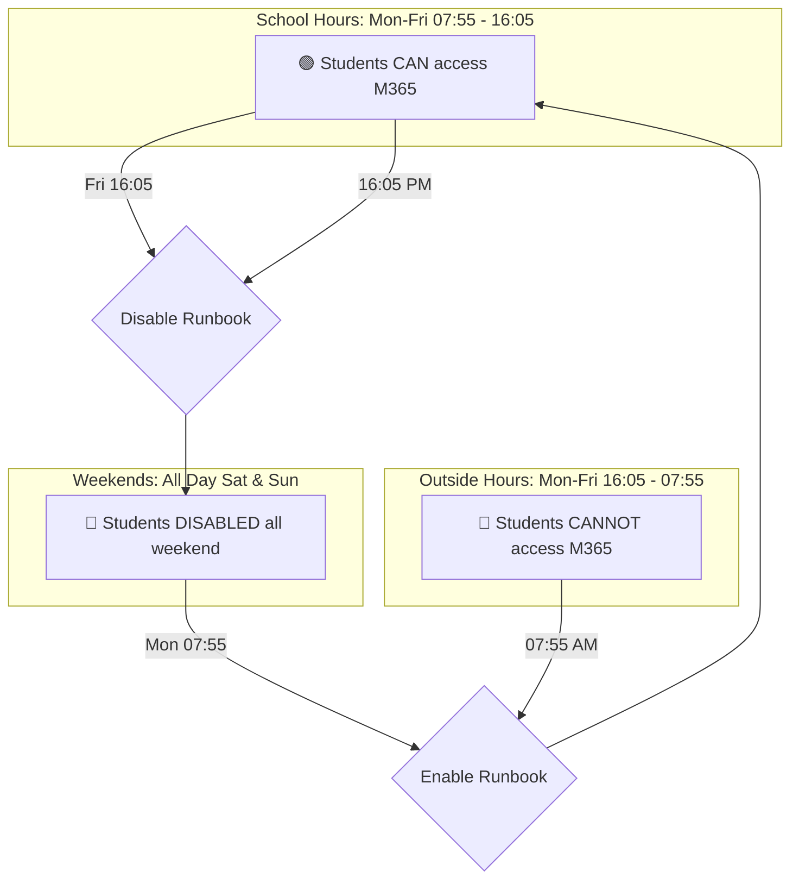

# Student Time Management for M365 - Solution Architecture

> Complete technical documentation with architecture diagrams for the Student Login Time Restriction solution.

---

## Table of Contents

1. [Executive Summary](#executive-summary)
2. [Solution Overview](#solution-overview)
3. [Architecture Diagrams](#architecture-diagrams)
4. [Component Details](#component-details)
5. [Data Flow](#data-flow)
6. [Security Architecture](#security-architecture)
7. [Deployment Architecture](#deployment-architecture)
8. [Alternative Solutions](#alternative-solutions)

---

## Executive Summary

This solution restricts student Microsoft 365 login times to school hours (07:55 AM - 04:05 PM, Monday-Friday) using Azure Automation and Microsoft Graph API in a cloud-only Entra ID environment. **Students remain disabled throughout weekends** (Saturday & Sunday).

### Key Facts

| Aspect | Details |
|--------|---------|
| **Problem** | Native time-based login restrictions not available in cloud-only Entra ID |
| **Solution** | Azure Automation scheduled runbooks |
| **Schedule** | Mon-Fri: 07:55 AM - 04:05 PM |
| **Weekends** | 🔴 **Disabled all day Saturday & Sunday** |
| **Cost** | €3-6/month |
| **Implementation Time** | 1-2 days |
| **Affected Users** | Only members of student security group |
| **Not Affected** | Teachers, admins, staff (not in student group) |

---

## Solution Overview

### Weekly Schedule

```
┌─────────────────────────────────────────────────────────────────────────────────┐
│                        WEEKLY ACCESS SCHEDULE                                    │
├──────────┬──────────┬──────────┬──────────┬──────────┬──────────┬──────────────┤
│  MONDAY  │ TUESDAY  │WEDNESDAY │ THURSDAY │  FRIDAY  │ SATURDAY │   SUNDAY     │
├──────────┼──────────┼──────────┼──────────┼──────────┼──────────┼──────────────┤
│          │          │          │          │          │          │              │
│  07:55   │  07:55   │  07:55   │  07:55   │  07:55   │          │              │
│   🟢     │   🟢     │   🟢     │   🟢     │   🟢     │   🔴     │     🔴       │
│ ENABLED  │ ENABLED  │ ENABLED  │ ENABLED  │ ENABLED  │ DISABLED │  DISABLED    │
│          │          │          │          │          │          │              │
│  16:05   │  16:05   │  16:05   │  16:05   │  16:05   │  ALL     │    ALL       │
│   🔴     │   🔴     │   🔴     │   🔴     │   🔴     │  DAY     │    DAY       │
│ DISABLED │ DISABLED │ DISABLED │ DISABLED │ DISABLED │          │              │
│          │          │          │          │          │          │              │
└──────────┴──────────┴──────────┴──────────┴──────────┴──────────┴──────────────┘
         ↑ Runbooks run Mon-Fri only. Students stay disabled Sat & Sun ↑
```

### Flow Diagram



### Who Is Affected?

| User Type | Affected? | Reason |
|-----------|-----------|--------|
| **Students** | ✅ YES | Members of StudentGroupId security group |
| **Teachers** | ❌ NO | Not in the student group |
| **Administrators** | ❌ NO | Not in the student group |
| **Staff** | ❌ NO | Not in the student group |

---

## Architecture Diagrams

### 1. High-Level Solution Architecture

```
┌─────────────────────────────────────────────────────────────────────────────────┐
│                              AZURE CLOUD                                         │
├─────────────────────────────────────────────────────────────────────────────────┤
│                                                                                  │
│  ┌─────────────────────────────────────────────────────────────────────────┐   │
│  │                        AZURE AUTOMATION                                  │   │
│  │  ┌─────────────────────┐              ┌─────────────────────┐          │   │
│  │  │                     │              │                     │          │   │
│  │  │  Enable-Student     │              │  Disable-Student    │          │   │
│  │  │  Access.ps1         │              │  Access.ps1         │          │   │
│  │  │                     │              │                     │          │   │
│  │  │  ┌───────────────┐  │              │  ┌───────────────┐  │          │   │
│  │  │  │ Schedule:     │  │              │  │ Schedule:     │  │          │   │
│  │  │  │ 07:55 AM      │  │              │  │ 04:05 PM      │  │          │   │
│  │  │  │ Mon-Fri       │  │              │  │ Mon-Fri       │  │          │   │
│  │  │  └───────────────┘  │              │  └───────────────┘  │          │   │
│  │  │                     │              │                     │          │   │
│  │  └──────────┬──────────┘              └──────────┬──────────┘          │   │
│  │             │                                    │                      │   │
│  │             │         ┌──────────────┐          │                      │   │
│  │             │         │  Encrypted   │          │                      │   │
│  │             └────────►│  Variables   │◄─────────┘                      │   │
│  │                       │  - TenantId  │                                  │   │
│  │                       │  - ClientId  │                                  │   │
│  │                       │  - Secret    │                                  │   │
│  │                       │  - GroupId   │                                  │   │
│  │                       └──────────────┘                                  │   │
│  └─────────────────────────────────────────────────────────────────────────┘   │
│                                    │                                            │
│                                    ▼                                            │
│  ┌─────────────────────────────────────────────────────────────────────────┐   │
│  │                      MICROSOFT GRAPH API                                 │   │
│  │                                                                          │   │
│  │   ┌────────────────────────────────────────────────────────────────┐   │   │
│  │   │  Endpoints Used:                                                │   │   │
│  │   │                                                                 │   │   │
│  │   │  • GET  /groups/{id}/members                                   │   │   │
│  │   │  • GET  /users/{id}                                            │   │   │
│  │   │  • PATCH /users/{id}  { "accountEnabled": true/false }         │   │   │
│  │   │  • POST /users/{id}/revokeSignInSessions                       │   │   │
│  │   │                                                                 │   │   │
│  │   └────────────────────────────────────────────────────────────────┘   │   │
│  └─────────────────────────────────────────────────────────────────────────┘   │
│                                    │                                            │
│                                    ▼                                            │
│  ┌─────────────────────────────────────────────────────────────────────────┐   │
│  │                         ENTRA ID (Azure AD)                              │   │
│  │                                                                          │   │
│  │   ┌────────────────────────────────────────────────────────────────┐   │   │
│  │   │  Student Security Group: "Students-M365"                        │   │   │
│  │   │                                                                 │   │   │
│  │   │  ┌─────┐ ┌─────┐ ┌─────┐ ┌─────┐ ┌─────┐ ┌─────┐              │   │   │
│  │   │  │ 👤  │ │ 👤  │ │ 👤  │ │ 👤  │ │ 👤  │ │ ... │  500+ users  │   │   │
│  │   │  └─────┘ └─────┘ └─────┘ └─────┘ └─────┘ └─────┘              │   │   │
│  │   │                                                                 │   │   │
│  │   │  accountEnabled: true ◄──────────► accountEnabled: false       │   │   │
│  │   │                                                                 │   │   │
│  │   └────────────────────────────────────────────────────────────────┘   │   │
│  └─────────────────────────────────────────────────────────────────────────┘   │
│                                                                                  │
└─────────────────────────────────────────────────────────────────────────────────┘
```

### 2. Sequence Diagram - Enable Flow (Morning)

```
┌──────────┐     ┌─────────────────┐     ┌─────────────┐     ┌──────────┐
│ Schedule │     │ Azure Automation│     │ Graph API   │     │ Entra ID │
└────┬─────┘     └────────┬────────┘     └──────┬──────┘     └────┬─────┘
     │                    │                     │                  │
     │  07:55 AM Trigger  │                     │                  │
     │───────────────────>│                     │                  │
     │                    │                     │                  │
     │                    │  Connect-MgGraph    │                  │
     │                    │────────────────────>│                  │
     │                    │                     │                  │
     │                    │  Auth Token         │                  │
     │                    │<────────────────────│                  │
     │                    │                     │                  │
     │                    │  Get-MgGroupMember  │                  │
     │                    │────────────────────>│                  │
     │                    │                     │  Query Group     │
     │                    │                     │─────────────────>│
     │                    │                     │                  │
     │                    │                     │  Member List     │
     │                    │                     │<─────────────────│
     │                    │  Members            │                  │
     │                    │<────────────────────│                  │
     │                    │                     │                  │
     │                    │  ┌─────────────────────────────────┐  │
     │                    │  │ For Each Student:               │  │
     │                    │  │                                 │  │
     │                    │  │  Update-MgUser                  │  │
     │                    │  │  accountEnabled = true          │  │
     │                    │  └─────────────────────────────────┘  │
     │                    │────────────────────>│                  │
     │                    │                     │  PATCH User      │
     │                    │                     │─────────────────>│
     │                    │                     │                  │
     │                    │                     │  ✓ Enabled       │
     │                    │                     │<─────────────────│
     │                    │                     │                  │
     │                    │  Disconnect-MgGraph │                  │
     │                    │────────────────────>│                  │
     │                    │                     │                  │
     │  Job Complete      │                     │                  │
     │<───────────────────│                     │                  │
     │                    │                     │                  │
```

### 3. Sequence Diagram - Disable Flow (Afternoon)

```
┌──────────┐     ┌─────────────────┐     ┌─────────────┐     ┌──────────┐
│ Schedule │     │ Azure Automation│     │ Graph API   │     │ Entra ID │
└────┬─────┘     └────────┬────────┘     └──────┬──────┘     └────┬─────┘
     │                    │                     │                  │
     │  04:05 PM Trigger  │                     │                  │
     │───────────────────>│                     │                  │
     │                    │                     │                  │
     │                    │  Connect-MgGraph    │                  │
     │                    │────────────────────>│                  │
     │                    │                     │                  │
     │                    │  Auth Token         │                  │
     │                    │<────────────────────│                  │
     │                    │                     │                  │
     │                    │  Get-MgGroupMember  │                  │
     │                    │────────────────────>│                  │
     │                    │                     │                  │
     │                    │  Members            │                  │
     │                    │<────────────────────│                  │
     │                    │                     │                  │
     │                    │  ┌─────────────────────────────────┐  │
     │                    │  │ For Each Student:               │  │
     │                    │  │                                 │  │
     │                    │  │  1. Update-MgUser               │  │
     │                    │  │     accountEnabled = false      │  │
     │                    │  │                                 │  │
     │                    │  │  2. Invoke-MgInvalidate         │  │
     │                    │  │     UserRefreshToken            │  │
     │                    │  │     (Force sign-out)            │  │
     │                    │  └─────────────────────────────────┘  │
     │                    │────────────────────>│                  │
     │                    │                     │  PATCH User      │
     │                    │                     │─────────────────>│
     │                    │                     │                  │
     │                    │                     │  ✓ Disabled      │
     │                    │                     │<─────────────────│
     │                    │                     │                  │
     │                    │────────────────────>│                  │
     │                    │                     │  Revoke Sessions │
     │                    │                     │─────────────────>│
     │                    │                     │                  │
     │                    │                     │  ✓ Sessions      │
     │                    │                     │    Revoked       │
     │                    │                     │<─────────────────│
     │                    │                     │                  │
     │  Job Complete      │                     │                  │
     │<───────────────────│                     │                  │
     │                    │                     │                  │
```

### 4. Component Architecture

```
┌─────────────────────────────────────────────────────────────────────────────────┐
│                            AZURE SUBSCRIPTION                                    │
├─────────────────────────────────────────────────────────────────────────────────┤
│                                                                                  │
│  ┌───────────────────────────────────────────────────────────────────────────┐ │
│  │                    Resource Group: rg-student-access-automation            │ │
│  │                                                                            │ │
│  │  ┌─────────────────────────────────────────────────────────────────────┐ │ │
│  │  │              Automation Account: StudentAccessAutomation             │ │ │
│  │  │                                                                      │ │ │
│  │  │  ┌──────────────────┐  ┌──────────────────┐  ┌──────────────────┐ │ │ │
│  │  │  │    RUNBOOKS      │  │    SCHEDULES     │  │    VARIABLES     │ │ │ │
│  │  │  │                  │  │                  │  │                  │ │ │ │
│  │  │  │  • Enable-       │  │  • Enable-       │  │  • TenantId      │ │ │ │
│  │  │  │    Student       │  │    Students-     │  │  • ClientId      │ │ │ │
│  │  │  │    Access.ps1    │  │    Morning       │  │  • ClientSecret  │ │ │ │
│  │  │  │                  │  │    07:55 Mon-Fri │  │    (encrypted)   │ │ │ │
│  │  │  │  • Disable-      │  │                  │  │  • StudentGroupId│ │ │ │
│  │  │  │    Student       │  │  • Disable-      │  │  • RevokeTokens  │ │ │ │
│  │  │  │    Access.ps1    │  │    Students-     │  │                  │ │ │ │
│  │  │  │                  │  │    Afternoon     │  │                  │ │ │ │
│  │  │  │  • Get-Student   │  │    16:05 Mon-Fri │  │                  │ │ │ │
│  │  │  │    Access        │  │                  │  │                  │ │ │ │
│  │  │  │    Status.ps1    │  │                  │  │                  │ │ │ │
│  │  │  │                  │  │                  │  │                  │ │ │ │
│  │  │  └──────────────────┘  └──────────────────┘  └──────────────────┘ │ │ │
│  │  │                                                                      │ │ │
│  │  │  ┌──────────────────────────────────────────────────────────────┐  │ │ │
│  │  │  │                      MODULES                                  │  │ │ │
│  │  │  │                                                               │  │ │ │
│  │  │  │  • Microsoft.Graph.Authentication                            │  │ │ │
│  │  │  │  • Microsoft.Graph.Users                                     │  │ │ │
│  │  │  │  • Microsoft.Graph.Groups                                    │  │ │ │
│  │  │  │                                                               │  │ │ │
│  │  │  └──────────────────────────────────────────────────────────────┘  │ │ │
│  │  │                                                                      │ │ │
│  │  └─────────────────────────────────────────────────────────────────────┘ │ │
│  │                                                                            │ │
│  └───────────────────────────────────────────────────────────────────────────┘ │
│                                                                                  │
└─────────────────────────────────────────────────────────────────────────────────┘
```

### 5. Security Architecture

```
┌─────────────────────────────────────────────────────────────────────────────────┐
│                          SECURITY ARCHITECTURE                                   │
├─────────────────────────────────────────────────────────────────────────────────┤
│                                                                                  │
│  ┌─────────────────────────────────────────────────────────────────────────┐   │
│  │                        ENTRA ID                                          │   │
│  │                                                                          │   │
│  │   ┌────────────────────────────────────────────────────────────────┐   │   │
│  │   │              App Registration                                   │   │   │
│  │   │              "Student-Access-Automation"                        │   │   │
│  │   │                                                                 │   │   │
│  │   │   ┌─────────────────────────────────────────────────────────┐ │   │   │
│  │   │   │  API Permissions (Application - Admin Consented)        │ │   │   │
│  │   │   │                                                         │ │   │   │
│  │   │   │  ┌─────────────────────────────────────────────────┐   │ │   │   │
│  │   │   │  │ Microsoft Graph                                 │   │ │   │   │
│  │   │   │  │                                                 │   │ │   │   │
│  │   │   │  │  • User.ReadWrite.All    ─── Enable/Disable    │   │ │   │   │
│  │   │   │  │  • Group.Read.All        ─── Read Membership   │   │ │   │   │
│  │   │   │  │  • Directory.Read.All    ─── Read User Data    │   │ │   │   │
│  │   │   │  │                                                 │   │ │   │   │
│  │   │   │  └─────────────────────────────────────────────────┘   │ │   │   │
│  │   │   │                                                         │ │   │   │
│  │   │   └─────────────────────────────────────────────────────────┘ │   │   │
│  │   │                                                                 │   │   │
│  │   │   ┌─────────────────────────────────────────────────────────┐ │   │   │
│  │   │   │  Credentials                                            │ │   │   │
│  │   │   │                                                         │ │   │   │
│  │   │   │  • Client ID (public)                                   │ │   │   │
│  │   │   │  • Client Secret (rotate annually) ──────────────────┐ │ │   │   │
│  │   │   │                                                       │ │ │   │   │
│  │   │   └───────────────────────────────────────────────────────┼─┘ │   │   │
│  │   │                                                           │   │   │   │
│  │   └───────────────────────────────────────────────────────────┼───┘   │   │
│  │                                                               │       │   │
│  └───────────────────────────────────────────────────────────────┼───────┘   │
│                                                                   │           │
│                                                                   ▼           │
│  ┌─────────────────────────────────────────────────────────────────────────┐ │
│  │                     AZURE AUTOMATION                                     │ │
│  │                                                                          │ │
│  │   ┌────────────────────────────────────────────────────────────────┐   │ │
│  │   │  Encrypted Variables (AES-256)                                  │   │ │
│  │   │                                                                 │   │ │
│  │   │  🔒 ClientSecret  ◄────────────────────────────────────────────┘   │ │
│  │   │  📋 TenantId                                                        │ │
│  │   │  📋 ClientId                                                        │ │
│  │   │  📋 StudentGroupId                                                  │ │
│  │   │                                                                 │   │ │
│  │   └────────────────────────────────────────────────────────────────┘   │ │
│  │                                                                          │ │
│  └─────────────────────────────────────────────────────────────────────────┘ │
│                                                                                │
└────────────────────────────────────────────────────────────────────────────────┘
```

### 6. Timeline Diagram

```
        DAILY SCHEDULE (Monday - Friday)
        
  00:00                    07:55        08:00                   16:00  16:05                    23:59
    │                        │            │                       │      │                        │
    │◄───────────────────────┼────────────┼───────────────────────┼──────┼───────────────────────►│
    │                        │            │                       │      │                        │
    │   ACCOUNTS DISABLED    │            │   ACCOUNTS ENABLED    │      │   ACCOUNTS DISABLED    │
    │   🔴 No Access         │            │   🟢 Full Access      │      │   🔴 No Access         │
    │                        │            │                       │      │                        │
    │                        ▼            │                       │      ▼                        │
    │                   ┌─────────┐       │                       │ ┌─────────┐                   │
    │                   │ ENABLE  │       │                       │ │ DISABLE │                   │
    │                   │ RUNBOOK │       │                       │ │ RUNBOOK │                   │
    │                   └─────────┘       │                       │ └─────────┘                   │
    │                        │            │                       │      │                        │
    │                        │            ▼                       ▼      │                        │
    │                        │       ┌─────────────────────────┐        │                        │
    │                        │       │                         │        │                        │
    │                        └──────►│    SCHOOL HOURS         │◄───────┘                        │
    │                                │    08:00 - 16:00        │                                 │
    │                                │                         │                                 │
    │                                └─────────────────────────┘                                 │
    │                                                                                            │
    │◄───────────────────────── 5 min buffer before school ──────►│                             │
    │                                                              │◄── 5 min buffer after ────►│
    │                                                                                            │
```

---

## Component Details

### Runbooks

| Runbook | Purpose | Schedule | Actions |
|---------|---------|----------|---------|
| `Enable-StudentAccess.ps1` | Enable accounts | 07:55 AM, Mon-Fri | Sets `accountEnabled = true` |
| `Disable-StudentAccess.ps1` | Disable accounts | 04:05 PM, Mon-Fri | Sets `accountEnabled = false`, revokes sessions |
| `Get-StudentAccessStatus.ps1` | Status report | On-demand | Lists all students with current status |

### Required PowerShell Modules

| Module | Version | Purpose |
|--------|---------|---------|
| `Microsoft.Graph.Authentication` | Latest | OAuth2 authentication |
| `Microsoft.Graph.Users` | Latest | User management |
| `Microsoft.Graph.Groups` | Latest | Group membership queries |

### API Permissions

| Permission | Type | Purpose | Risk Level |
|------------|------|---------|------------|
| `User.ReadWrite.All` | Application | Enable/disable accounts | High |
| `Group.Read.All` | Application | Read group membership | Medium |
| `Directory.Read.All` | Application | Read user properties | Medium |

---

## Data Flow

### Morning Enable Flow

```
1. Azure Scheduler triggers at 07:55 AM
         │
         ▼
2. Enable-StudentAccess.ps1 starts
         │
         ▼
3. Retrieve encrypted credentials from variables
         │
         ▼
4. Connect to Microsoft Graph API
         │
         ▼
5. Query student group members
         │
         ▼
6. For each student:
   ├── Check current status
   ├── If disabled → Enable account
   └── Log action
         │
         ▼
7. Disconnect and report results
```

### Afternoon Disable Flow

```
1. Azure Scheduler triggers at 04:05 PM
         │
         ▼
2. Disable-StudentAccess.ps1 starts
         │
         ▼
3. Retrieve encrypted credentials from variables
         │
         ▼
4. Connect to Microsoft Graph API
         │
         ▼
5. Query student group members
         │
         ▼
6. For each student:
   ├── Check current status
   ├── If enabled → Disable account
   ├── Revoke all refresh tokens
   └── Log action
         │
         ▼
7. Disconnect and report results
```

---

## Deployment Architecture

### Option A: Direct PowerShell Deployment

```
┌──────────────────┐     ┌──────────────────┐     ┌──────────────────┐
│   Admin PC       │     │   Azure Portal   │     │   Entra ID       │
│                  │     │                  │     │                  │
│  ┌────────────┐  │     │  ┌────────────┐  │     │  ┌────────────┐  │
│  │ PowerShell │──┼────►│  │ Automation │  │     │  │    App     │  │
│  │ Scripts    │  │     │  │  Account   │  │     │  │Registration│  │
│  └────────────┘  │     │  └────────────┘  │     │  └────────────┘  │
│                  │     │                  │     │                  │
└──────────────────┘     └──────────────────┘     └──────────────────┘
```

### Option B: Infrastructure as Code (Bicep)

```
┌──────────────────┐     ┌──────────────────┐     ┌──────────────────┐
│   Source Code    │     │   Azure CLI      │     │   Azure          │
│                  │     │                  │     │                  │
│  ┌────────────┐  │     │  ┌────────────┐  │     │  ┌────────────┐  │
│  │ main.bicep │──┼────►│  │    az      │──┼────►│  │ Resources  │  │
│  │            │  │     │  │ deployment │  │     │  │  Created   │  │
│  └────────────┘  │     │  └────────────┘  │     │  └────────────┘  │
│                  │     │                  │     │                  │
└──────────────────┘     └──────────────────┘     └──────────────────┘
```

### Option C: GitHub Actions (CI/CD)

```
┌──────────────────┐     ┌──────────────────┐     ┌──────────────────┐
│   GitHub Repo    │     │  GitHub Actions  │     │   Azure          │
│                  │     │                  │     │                  │
│  ┌────────────┐  │     │  ┌────────────┐  │     │  ┌────────────┐  │
│  │   Push     │──┼────►│  │  Workflow  │──┼────►│  │ Resources  │  │
│  │ to main    │  │     │  │   (OIDC)   │  │     │  │  Deployed  │  │
│  └────────────┘  │     │  └────────────┘  │     │  └────────────┘  │
│                  │     │                  │     │                  │
└──────────────────┘     └──────────────────┘     └──────────────────┘
```

---

## Alternative Solutions

### Comparison Matrix

```
┌─────────────────────────────────────────────────────────────────────────────────┐
│                      SOLUTION COMPARISON MATRIX                                  │
├────────────────────────┬─────────┬─────────┬──────────┬───────────┬─────────────┤
│ Solution               │ Cloud   │ UX      │ Cost     │ Complex-  │ Recommended │
│                        │ Only    │ Quality │ /Month   │ ity       │             │
├────────────────────────┼─────────┼─────────┼──────────┼───────────┼─────────────┤
│ ★ Azure Automation     │   ✅    │   ⚠️    │  €3-6    │  Medium   │     ⭐      │
├────────────────────────┼─────────┼─────────┼──────────┼───────────┼─────────────┤
│ Hybrid AD + PTA        │   ❌    │   ✅    │  €€€     │  High     │     ❌      │
├────────────────────────┼─────────┼─────────┼──────────┼───────────┼─────────────┤
│ Intune Device Control  │   ✅    │   ✅    │  Free*   │  Medium   │   Partial   │
├────────────────────────┼─────────┼─────────┼──────────┼───────────┼─────────────┤
│ Conditional Access     │   ✅    │   ✅    │  Free    │  Low      │   N/A**     │
├────────────────────────┼─────────┼─────────┼──────────┼───────────┼─────────────┤
│ Third-party            │   ✅    │   ✅    │ €3-8/user│  Low      │  If budget  │
│ (GoGuardian, etc.)     │         │         │  /year   │           │  allows     │
└────────────────────────┴─────────┴─────────┴──────────┴───────────┴─────────────┘

* Requires Intune license
** Does not support time-based restrictions
```

---

## Document Information

| Field | Value |
|-------|-------|
| **Version** | 1.0 |
| **Author** | Atea AS |
| **Date** | January 2026 |
| **License** | MIT |
| **Repository** | https://github.com/NorwegianPear/StudentTime-Management-M365 |

---

*For implementation details, see the [README.md](../README.md) file.*
